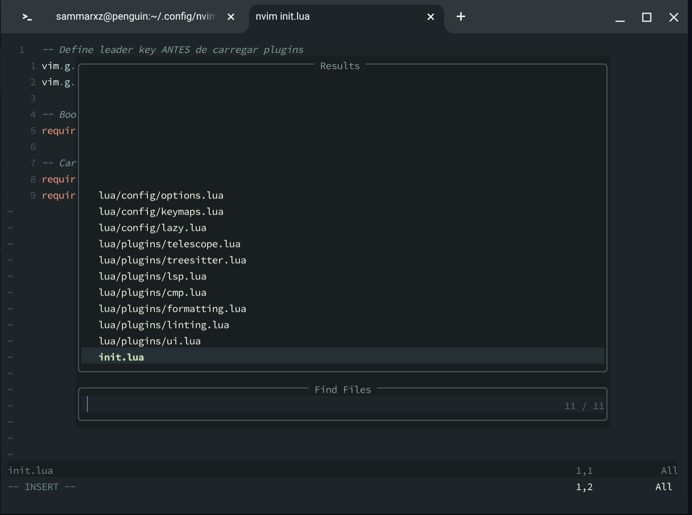

# 🌿 Personal Neovim Config

Uma configuração minimalista e moderna do Neovim focada em produtividade e performance.



## ✨ Features

- 🎨 **Tema**: Evergarden (variante winter)
- 🔍 **Busca fuzzy**: Telescope para arquivos e texto
- 🌳 **Syntax highlight**: Tree-sitter com suporte a múltiplas linguagens
- 💬 **Autocompletar**: nvim-cmp com LSP integration
- 🔧 **LSP**: Pyright (Python) e ts_ls (TypeScript/JavaScript)
- ✨ **Formatação automática**: Conform.nvim (formata ao salvar)
- 🐛 **Linting**: nvim-lint com pylint e eslint_d
- 📟 **Terminal flutuante**: toggleterm.nvim
- 🎯 **Indentação visual**: indent-blankline
- 📝 **Git integration**: gitsigns
- 📋 **Clipboard**: OSC52 para terminals remotos

## 📋 Requisitos

- Neovim >= 0.9.0
- Git
- Node.js (para LSP servers)
- Python 3.x (para LSP e formatadores)

### Ferramentas Externas

**Formatadores:**
```bash
# Python
pip install black isort

# JavaScript/TypeScript
npm install -g prettier

# Lua (opcional)
cargo install stylua
```

**Linters:**
```bash
# Python
pip install pylint

# JavaScript/TypeScript
npm install -g eslint_d
```

**Language Servers:**
```bash
# Python
npm install -g pyright

# TypeScript/JavaScript
npm install -g typescript-language-server typescript
```

## 🚀 Instalação

```bash
# Backup da configuração antiga (se existir)
mv ~/.config/nvim ~/.config/nvim.backup

# Clone este repositório
git clone https://github.com/sammarxz/nvim.git ~/.config/nvim

# Abra o Neovim (plugins serão instalados automaticamente)
nvim
```

Na primeira execução, aguarde o lazy.nvim instalar todos os plugins.

## ⌨️ Atalhos Principais

**Leader key:** `,`

### Arquivos e Navegação
| Atalho | Descrição |
|--------|-----------|
| `Ctrl+p` | Buscar arquivos |
| `Ctrl+f` | Buscar texto no projeto |
| `,w` | Salvar arquivo |
| `,q` | Fechar arquivo |
| `Shift+h` | Buffer anterior |
| `Shift+l` | Próximo buffer |

### Terminal
| Atalho | Descrição |
|--------|-----------|
| `,t` | Toggle terminal flutuante |

### Formatação
| Atalho | Descrição |
|--------|-----------|
| `,f` | Formatar buffer/seleção |
| Auto | Formata ao salvar |

### LSP
| Atalho | Descrição |
|--------|-----------|
| `gd` | Go to definition |
| `gr` | Show references |
| `K` | Hover documentation |
| `[d` | Diagnóstico anterior |
| `]d` | Próximo diagnóstico |

### Edição
| Atalho | Descrição |
|--------|-----------|
| `J/K` | Mover linha(s) (visual mode) |
| `</>`  | Indentar (visual mode) |
| `Y` | Copiar para clipboard (visual mode) |


## 🎨 Personalização

### Mudar tema
Edite `lua/plugins/ui.lua`:
```lua
opts = {
  theme = { 
    variant = "winter", -- winter | summer | spring | fall
    accent = "green"    -- red | orange | yellow | green | ...
  },
}
```

### Adicionar linguagem ao Tree-sitter
Edite `lua/plugins/treesitter.lua`:
```lua
ensure_installed = {
  -- ... linguagens existentes
  "rust", "go", "cpp", -- adicione aqui
}
```

### Adicionar novo LSP
Edite `lua/plugins/lsp.lua` e adicione:
```lua
vim.api.nvim_create_autocmd("FileType", {
  pattern = "rust", -- tipo de arquivo
  callback = function()
    vim.lsp.start({
      name = "rust_analyzer",
      cmd = { "rust-analyzer" },
      capabilities = capabilities,
      root_dir = get_root_dir(vim.api.nvim_buf_get_name(0)),
    })
  end,
})
```

## 📄 Licença

MIT

## 🙏 Créditos

Plugins utilizados:
- [lazy.nvim](https://github.com/folke/lazy.nvim)
- [telescope.nvim](https://github.com/nvim-telescope/telescope.nvim)
- [nvim-treesitter](https://github.com/nvim-treesitter/nvim-treesitter)
- [nvim-lspconfig](https://github.com/neovim/nvim-lspconfig)
- [nvim-cmp](https://github.com/hrsh7th/nvim-cmp)
- [conform.nvim](https://github.com/stevearc/conform.nvim)
- [nvim-lint](https://github.com/mfussenegger/nvim-lint)
- [toggleterm.nvim](https://github.com/akinsho/toggleterm.nvim)
- [evergarden](https://github.com/comfysage/evergarden)
- [gitsigns.nvim](https://github.com/lewis6991/gitsigns.nvim)

---

<div align="center">
Feito com 💚 e Neovim
</div>
